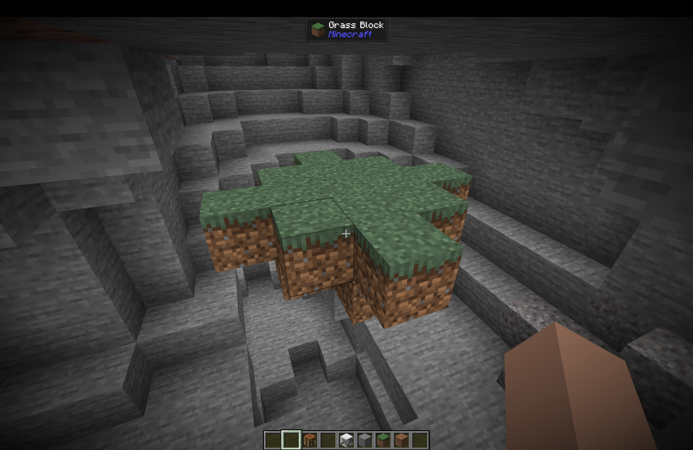

### Simple floating island feature type

This feature type can create a simple floating island in a large cave.

Proper conditions are already enforced for valid placement of the feature.

Additionally, it can also place any number of placed features on it's top and last layer.

Note that the layers are applied in reverse order than they are defined in JSON (That is, the layers are applied like they will be created on the world).

Feature type syntax:

~~~
object(ConfiguredFeature), required
{
    "type": resourcelocation(FeatureType), must_have_value="mdex:simple_floating_layered_island"
    "config": object(SimpleFloatingIslandConfiguration), required
    {
        "layers": list<<CompilableIslandLayer>>, required
        "max_distance_from_ground": <IntProvider>, range=[1, 8], required
        "additional_features_on_top": list<object(PlacedFeature)>, optional, default_value=[], can_be_empty
    }
}
~~~

Where the `CompilableIslandLayer` object data is:

~~~
object(CompilableIslandLayer), required
{
    "state": object(BlockState), required
    "size": int, range=[1, 32], required
}
~~~

An example JSON of the feature and it's usage on the world:

~~~JSON
{
    "type": "mdex:simple_floating_layered_island",
    "config": {
        "max_distance_from_ground": {
            "type": "minecraft:uniform",
            "value": {
                "min_inclusive": 3,
                "max_inclusive": 5
            }
        },
        "layers": [
            {
                "size": 3,
                "state": {
                    "Name": "minecraft:grass_block"
                }
            }, 
            {
                "size": 2,
                "state": {
                    "Name": "minecraft:dirt"
                }
            },
            {
                "size": 1,
                "state": {
                    "Name": "minecraft:stone"
                }
            }
        ]
    }
}
~~~

This would look like the following:

