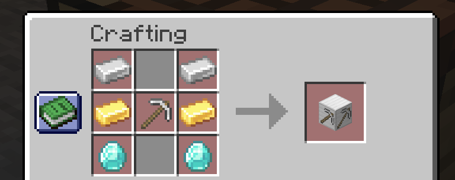

# Mining Dimension: EX

### A mod by `mdcdi1315`, based on the [Advanced Mining Dimension](https://github.com/henkelmax/advanced-mining-dimension) mod, extending it and looking far beyond than the original implementation.

#### ***IMPORTANT***: Mod requires [Balm](https://www.curseforge.com/minecraft/mc-mods/balm) in order for the mod to work.

This mod adds a highly configurable mining dimension - that is, a dimension consisting only of caves.

Its purpose is to be the home for common resources for modpacks that need tons of grinding.

Apart from that it adds a set of new blocks for the dimension and some copper tools for older Minecraft versions, 
plus some other features focusing on performance to assist with datapack worldgen configurations.

Note also that the mod does not define any ores or gameplay features for the dimension itself - this is left up to you to define.

If you feel that is too hard for you to create a datapack adding the features you require , consider using the [Default MD Experience Data Pack] provided.

### Starting with the Dimension 

To start with the dimension, you must create it's dedicated teleporter.

The recipe is this:

After you do that, you have access to the dimension itself.

### Differences with the original implementation

This section is for those who are interested about the changes in this mod compared to the original `Advanced Mining Dimension` mod implementation.
Do not read it if you do not care about the changes.

As stated above, this implementation is a fork of the `Advanced Mining Dimension` mod.

-> The original implementation had the teleporter hardcoded. This one tries to clean the code.

-> This mod uses the Balm library for eventually making the mod cross-loader. The original is only Forge.

-> The mod adds additional blocks and items to the game along with the teleporter.

-> The mod also ships with additional datapack utilities that datapack developers can use.
This is done so that someone does not necessarily need to write a new mod.
This was not done in the original implementation and was not even in the author's intentions.

-> The mod provides 8 new feature types, all of them useful for many applications. 
Due to this, the mod does also perform some performance optimizations for it's shipped feature types.

### Development notes

The mod is currently built against Minecraft Forge 1.20.1 and it's main changes are happening there first.

NeoForge is also supported as well as Forge too with versions provided for 1.21.1 and 1.21.5 .

Fabric support is not ready yet because Fabric defines a different API set, thus support for it will take a little bit longer...